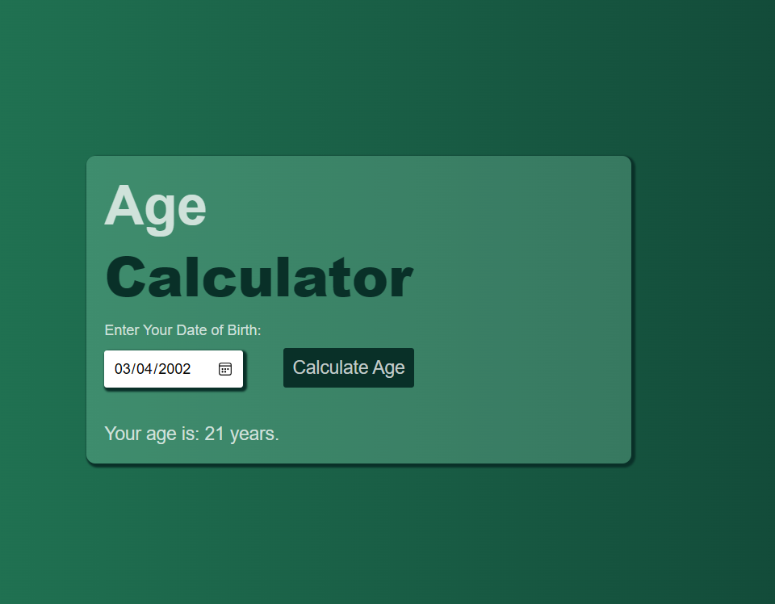

# A Simple Javascript Age Calculator

This project was created to demostrate the use of jaascript functions for Dom manupilation.

##### Getting Started

###### Prerequisites

There are no special requirements for this simple quiz app project.

###### Installing

1. Clone the repositrory to your local machine

```
git remote add origin git@github.com:Hashmozy/date-cal.git
```

```
cd date-calc
```

3. run the project

```
node app.js
```

###### Usage

This project can be used for learning


